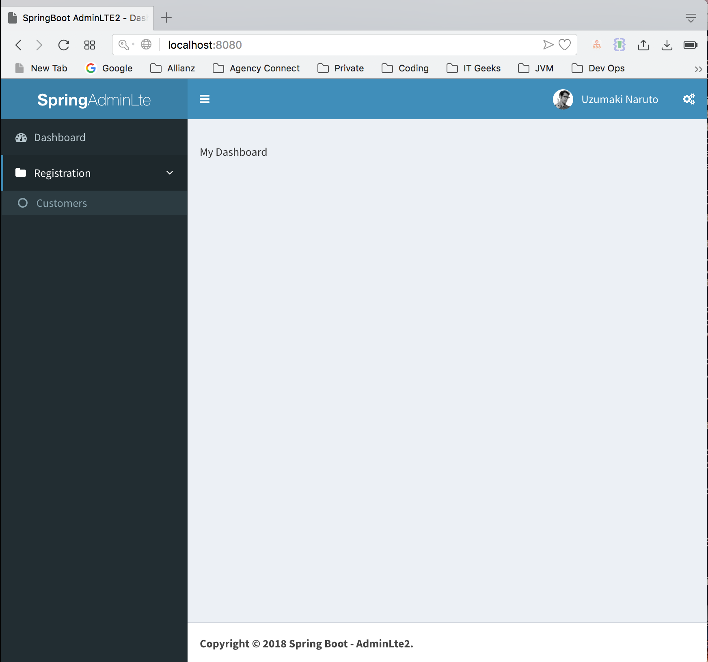
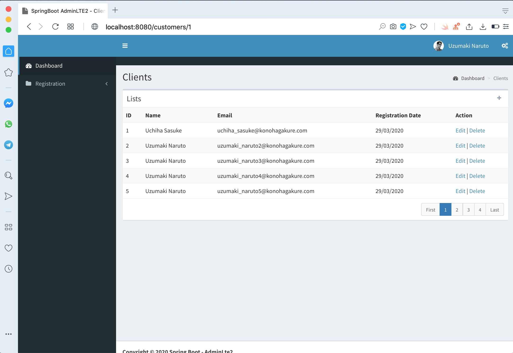

This repository contains a web application implemented with Spring Framework (Java). The application is a CRUD of an admin system available in [spring-boot-adminlte](https://github.com/hendisantika/spring-boot-adminlte) project.  
. 


### Content
- [Prerequisites](#prerequisites)
- [How to Install and to Run](#how-to-install-and-to-run)
- [Available Pages](#available-pages)


## Prerequisites

- Java (version 11)
- Docker compose (_optional_)
- Maven

## How to Install and to Run

In your computer, run the following commands to clone in your local machine:

```
$ git clone https://github.com/Samuellucas97/Admin-CI-CD  
$ cd Admin-CI-CD
```
After this, we need to start database service. We will use Docker technology to do this. But you can use whatever database service you want.
Otherwise, **it's very important to have the same configuration used in `application.yaml`.**

We are setting the file `src/main/resource/application.yaml` as following:

- Database name: `spring_adminlte`
- Database user: `root`
- Database password: `root`

### Running database service with Docker compose (_optional_)

Since you have installed Docker compose, just execute the following instruction at terminal:

```
$ docker-compose up -d
```

It will be generated a database service container according `docker-compose.yaml`.


### Running application

Since you have a database running in you local machine, you have the following set of available commands:

|                Command               |              Information             |
|:------------------------------------:|:------------------------------------:|
| To run the application  on port 8080 |          `mvn spring-boot:run`         |
|           To run tests          |     `mvn clean test`    |
|      To generate project's build     |    `mvn clean package`    |
|  To run end-to-end test | `mvn test`

If the application is running, you will have only this user registered:

- ***username***: `admin`
- ***password***: `1234`

## Available Pages

| Title Page |                URL               |              Screenshots             |
|:------------------------------------:|:------------------------------------:|:------------------------------------:|
| Login | http://localhost:8080/login |                   |
| Dashboard | http://localhost:8080/login |                  |
| Add Customer | http://localhost:8080/login |                  |
| List of Customers | http://localhost:8080/login |                  |


