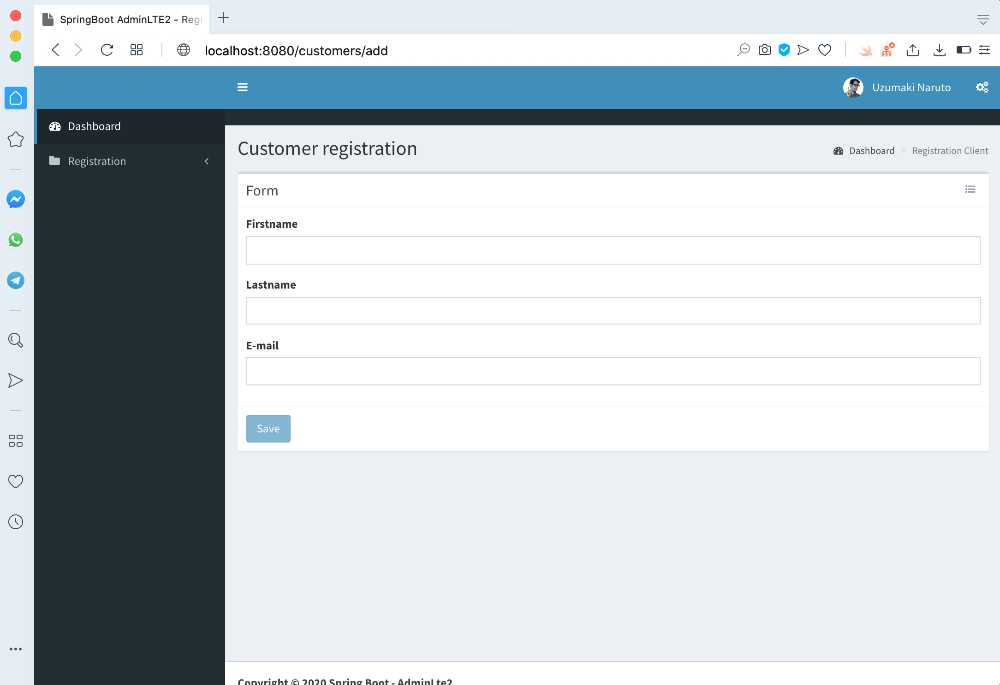

    
This repository contains a web application implemented with Spring Framework (Java). The application is a CRUD of an admin system available in [spring-boot-adminlte](https://github.com/hendisantika/spring-boot-adminlte) project.  

We use GitLab CI/CD & Heroku to execute the continuous delivery pipeline. You can found the GitLab version of this project here:  [https://gitlab.com/Samuellucas97/Admin-CI-CD](https://gitlab.com/Samuellucas97/Admin-CI-CD).

App deployed:
- `Staging mode`: [https://admin-lte2-staging.herokuapp.com](https://admin-lte2-staging.herokuapp.com)
- `Production mode`: [https://admin-lte2.herokuapp.com](https://admin-lte2.herokuapp.com)


### Content
- [Prerequisites](#prerequisites)
- [How to Install and to Run](#how-to-install-and-to-run)
  - [Running database service with Docker compose (_optional_)](#running-database-service-with-docker-compose-optional)
  - [Running application](#running-application)
- [Available Pages](#available-pages)
- [GitLab CI/CD & Heroku](#gitlab-cicd--heroku)


## Prerequisites

- Java (version 11)
- Postgres database service
- Docker compose (_optional_)
- Maven
- Google Chrome

## How to Install and to Run

In your computer, run the following commands to clone in your local machine:

```
$ git clone https://github.com/Samuellucas97/Admin-CI-CD  
$ cd Admin-CI-CD
```
After this, we need to start database service. We will use Docker technology to do this. But you can use whatever database service you want.
Otherwise, **it's very important to have the same configuration used in `application.yaml`.**

We are setting the file `src/main/resource/application.yaml` as following:

- Database name: `spring_adminlte`
- Database user: `sa`
- Database password: `root`

### Running database service with Docker compose (_optional_)

Since you have installed Docker compose, just execute the following instruction at terminal:

```
$ docker-compose up -d
```

It will be generated a database service container according `docker-compose.yaml`.


### Running application

Since you have a database running in you local machine, you have the following set of available commands:

|                Command               |              Information             |
|:------------------------------------:|:------------------------------------:|
| To run the application  on port 8080 |          `mvn spring-boot:run`         |
|      To generate project's build     |    `mvn clean package`    |
|  To run end-to-end test (headless mode activated) | `mvn test` |
|  To run end-to-end test (with graphic interface activated) | `HEADLESS=false mvn test` |
| To run tests and generate HTML test report  (available in `target/site/surefire-report.html`)| `mvn surefire-report:report site -DgenerateReports=false` |
| To run end-to-end test on staging environment | `SPRING_PROFILES_ACTIVE='staging' HOST='<protocol><your host>' mvn clean test` |

If the application is running, you will have only this user registered:

- ***username***: `admin`
- ***password***: `1234`

## Available Pages

| Title Page |                URL               |              Screenshots             |
|:------------------------------------:|:------------------------------------:|:------------------------------------:|
| Login | http://localhost:8080/login |                   |
| Dashboard | http://localhost:8080/ |                  |
| Add Customer | http://localhost:8080/login |                  |
| List of Customers | http://localhost:8080/login |                  |


## GitLab CI/CD & Heroku

If you have cloned this repository, and you would like to execute the pipeline available on `.gitlab-ci.yaml`, you have: 

1. access the Heroku platform
2. create two new Heroku app (staging app and production app)
3. add Postgres as add-on
4. get Heroku API Key from your account
5. access GitLab.com platform
6. create a new project
7. choose the option`Run CI/CD for external repository`
8. import from GitHub 
   1. For this, you will need connect your GitHub account with your GitLab account
9. Create new variables in `Setting -> CI/CD`
   1. name: HEROKU_APP_STAGING; value: `<name of your staging app>`
   2. name: HEROKU_APP_PRODUCTION; value: `<name of your production app>`
   3. name: HEROKU_API_KEY; value: `<heroku api key>`


With the pipeline result is ok, then try to access your site in [https://<HEROKU_APP_PRODUCTION>.herokuapp.com]() 